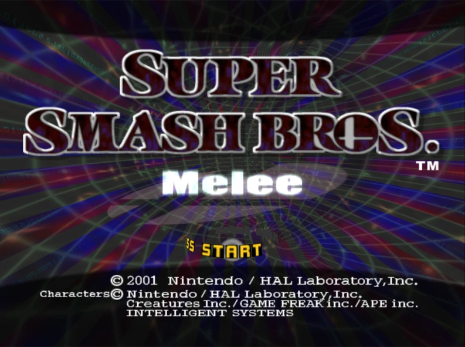
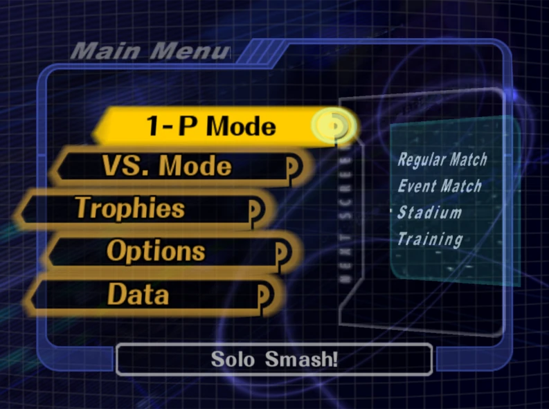
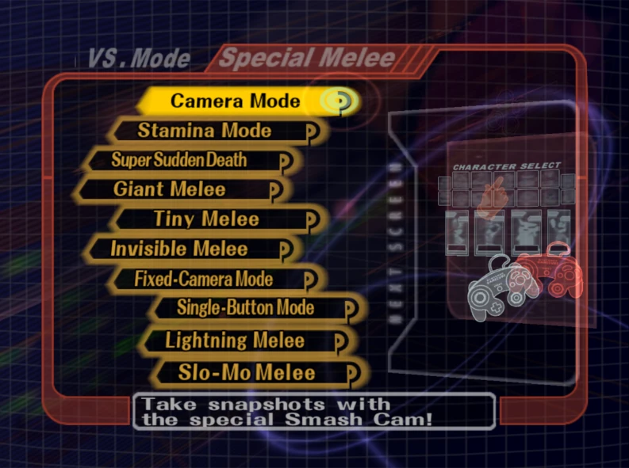

## ssbm website

- a website replicating the look of Super Smash Bros Melee's menus
- theoretically, the website will look like these screenshots:

|  |  |  |
| :----------------------------------------------------: | :----------------------------------------------: | :---------------------------------------------------------------: |

## [assets/](./assets/)

- this directory contains a raw dump of (most of) the textures I will use for the website. the assets are unsorted and often in multiple pieces currently

## license

- [agpl v3](./ssbmWebsite/license)
